# Assembly
## Notes
None of the 3D printed parts require supports. I recommend printing in PETG, or at least Tough PLA. Tires need to be printed in TPU. Large parts contain built-in pads to prevent curling - simply remove them after the print is complete. In most cases, you need to drive M3 bolts directly into the holes in plastic. If you're having trouble getting the bolt to go in when securing a part, prime the hole with a bolt for a few millimeters and then try again. Don't overtighten. When connecting wires to the Raspberry Pi, use <a href="https://raw.githubusercontent.com/nikivanov/watney/master/images/pi-gpio.png">this image</a> for reference.
## Base
<a href="images/assembly/charger.jpg">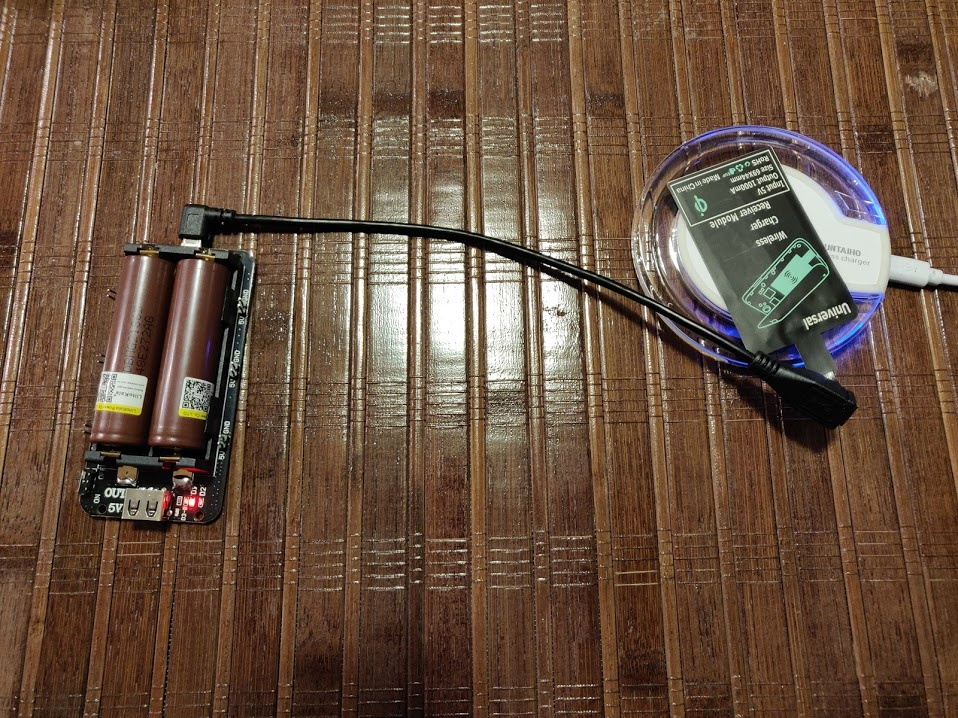</a>
<a href="images/assembly/wireless_client.jpg">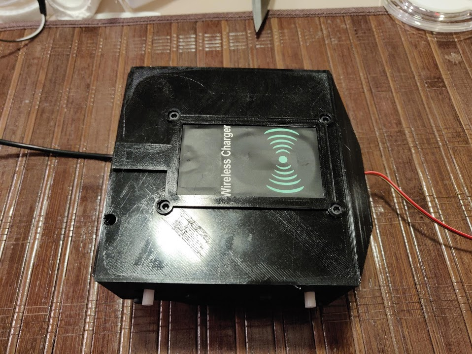</a>
<a href="images/assembly/motors.jpg">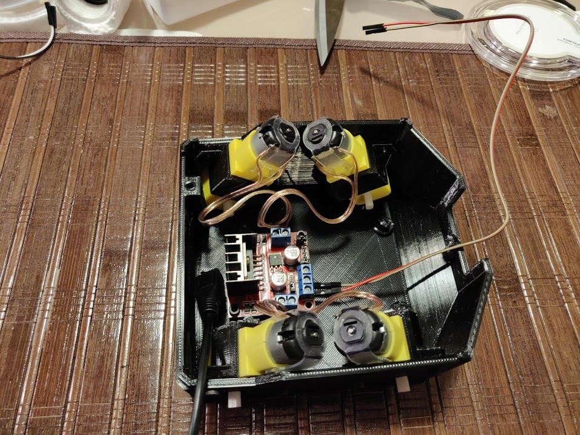</a>

1. Print out bottom.stl, 4x motor holder.stl, charger client holder.stl
1. Break off 6 pairs of pin headers and solder them to the Dual 18650 board.
1. Insert 18650 batteries. Ensure the correct polarity, or you will burn out the board.
1. Connect the wireless charger to a 2A USB power supply.
1. Connect the wireless client to the extension cable, and then plug the cable into the charging port of the board. Place the client onto the charger and make sure it starts charging. Once you verified that wireless charging works, plug the power supply into the power board directly to charge the batteries.
1. Turn on the power board and use MF Dupont wire to test each motor by connecting its contacts to one of the 5V ports.
1. Place the charger client onto the bottom and place the charger client holder on top of it. Push the holder into the bottom and secure it with 6mm bolts.
1. Attach the Micro USB extension cable to the charger client.
1. Solder about 15cm of wire to each motor and then connect the other ends in parallel. Make sure not to reverse polarity, or the motors will spin in different directions. I recommend soldering with wires pointing towards the axle.
1. Drive an M3 nut into slots of each motor holder, 8 total.
1. Place each motor into its slot, as shown in the picture. Place a motor holder over each motor and align the holes. Use 8mm bolts from the outside to pull each holder to the wall. Make sure all motors are held tightly in place.
1. Insert the motor wire leads into L298N H-Bridge. Polarity here doesn't matter much because we'll be able to set it in the config later.
1. Gently place L298N onto the mounting holes in the bottom and secure it with 6mm bolts. You should only need to use 2 bolts.
1. Attach a pair of 30cm MF Dupont wires to the 12V (VCC) and GND of L298N. Make sure you're not attaching to the 5V - it's an output.
1. Mount the tires onto the wheels. Make sure you mount them in the correct orientation, since you probably won't be able to take them off. The orientation is mostly decorative. You can attach the wheels now or wait until the rest of the rover is assembled.
## Cover
<a href="images/assembly/audiojack1.jpg">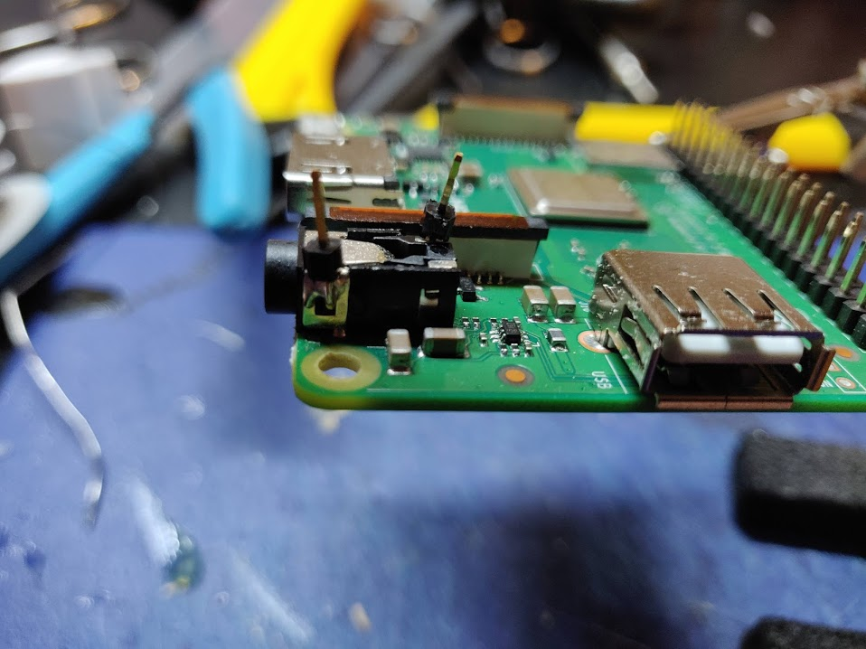</a>

<a href="images/assembly/servo.jpg">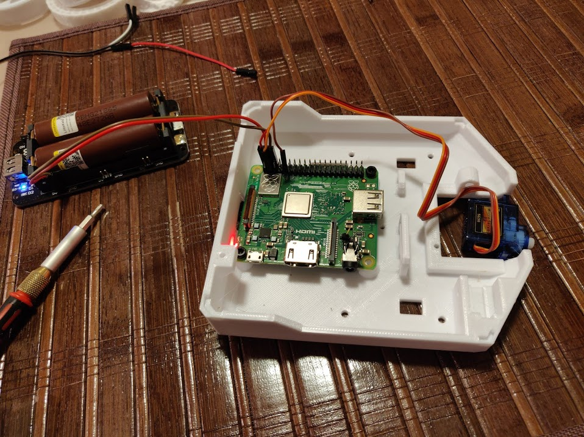</a>
<a href="images/assembly/camera.jpg">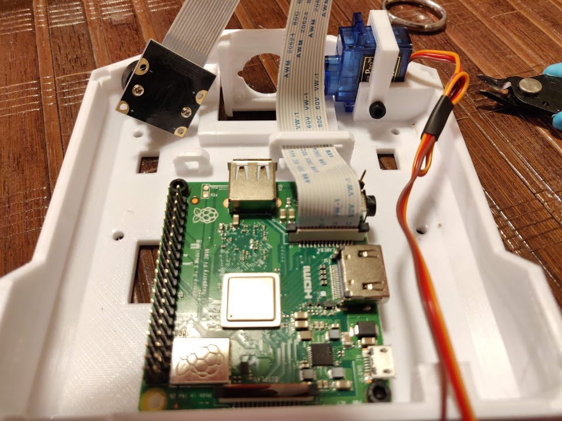</a>
<a href="images/assembly/bucket.jpg">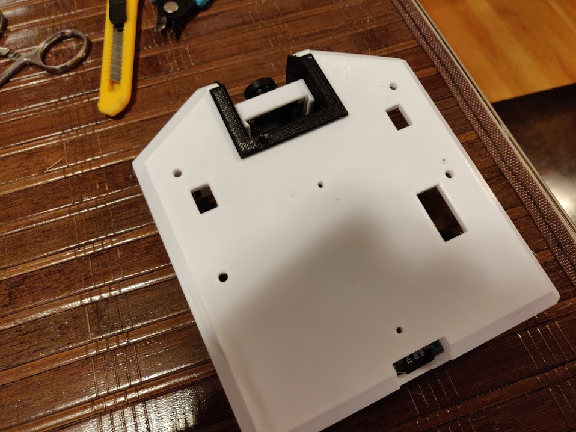</a>

1. Print out cover.stl, servo holder.stl, camera bucket.stl, power board standoff.stl, camera body.stl, camera door.stl
1. Solder 2 single pin headers to the audio jack of the raspberry pi, as shown in pictures. You will need to scrape off some plastic for one of them.
1. M3 bolts are a bit too big for Raspberry Pi mounting holes. Run a 1/8" drill bit through them, file them, or just put an M3 bolt through them carefully to expand them a bit.
1. Download the latest Watney SD Card Image from the Releases page and burn it onto the SD card Insert the card into the Raspberry Pi.
1. SG90 Servo connector layout isn't compatible with Raspberry Pi. Lift the small plastic pieces that hold the Dupont connectors in the socket of the servo connector body. Do the same thing to 2 Dupont wires, so you have 3 single Dupont connector plastic pieces. Insert the servo's connectors into those pieces.
1. Connect 5V and GND from the power board to GPIO board pins 2 and 6.
1. Connect the servo to the Raspberry Pi:
    * Red       Pin 4 (5V)
    * Orange    Pin 3 (GPIO2)
    * Brown     Pin 9 (Gnd)
1. Turn on the power board. The Raspberry Pi should start. Wait for it to boot. The servo should rotate back and forth when it's booted. Watney will host a hotspot called Watney4. Join it, go to http://192.168.4.1 and set up your WiFi. Watney will reboot. Once it's finished booting, you'll hear the servo move around again. Shut down Watney and make sure not to move the servo manually.
1. Insert the servo into the servo slot, put the servo holder over it and secure it with a 6mm bolt.
1. Insert the camera door into the camera body a few times to smooth the edges. Set the door aside.
1. Take the long servo arm and cut it below the second hole so it aligns with the indentation in the camera body. Secure it to the camera body with one of the provided screws.
1. Attach the camera body to the servo so the body is vertical.
1. Thread the camera cable through its slot and attach it to the camera port on the raspberry pi.
1. Place the camera into the camera body, then insert the camera bucket over the camera body and the servo. Be careful not to push onto the camera body too much, or you risk damaging the servo. You will need to keep the camera lens inserted half-way into the camera body to put the bucket over it.
1. Use a 6mm bolt to attach the other side of the camera body.
1. Insert the door into the camera body. You can gently pull on the lens to make sure the camera board is lined up.
1. Use a 8mm bolt to attach the bucket to the top of the cover.
1. Take the batteries out of the board, place the standoff onto the bottom of the board and use 12mm bolts to attach it to the top of the cover.
1. Place the batteries back in. Connect 5V and GND from the power board to GPIO board pins 2 and 6 with 10CM Dupont wires.
## Audio Bonnet
<a href="images/assembly/bonnet-1.jpg">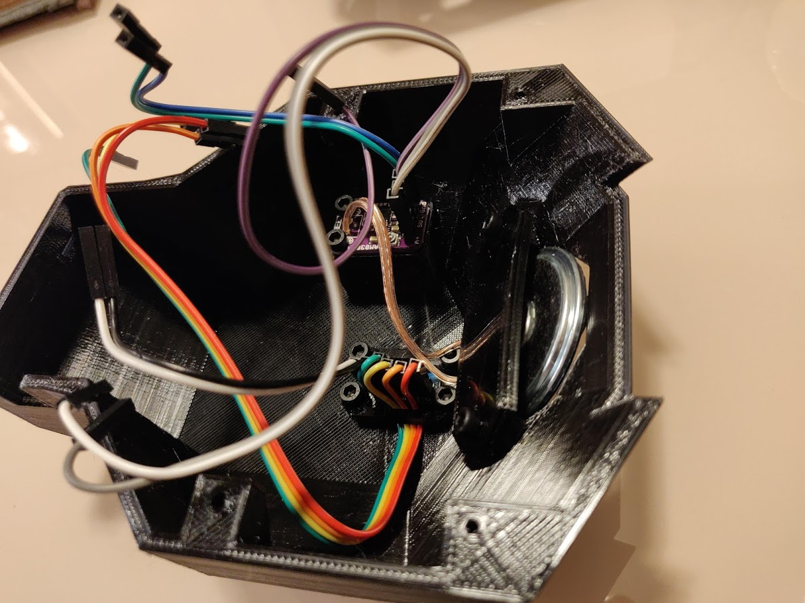</a>
<a href="images/assembly/bonnet-2.jpg">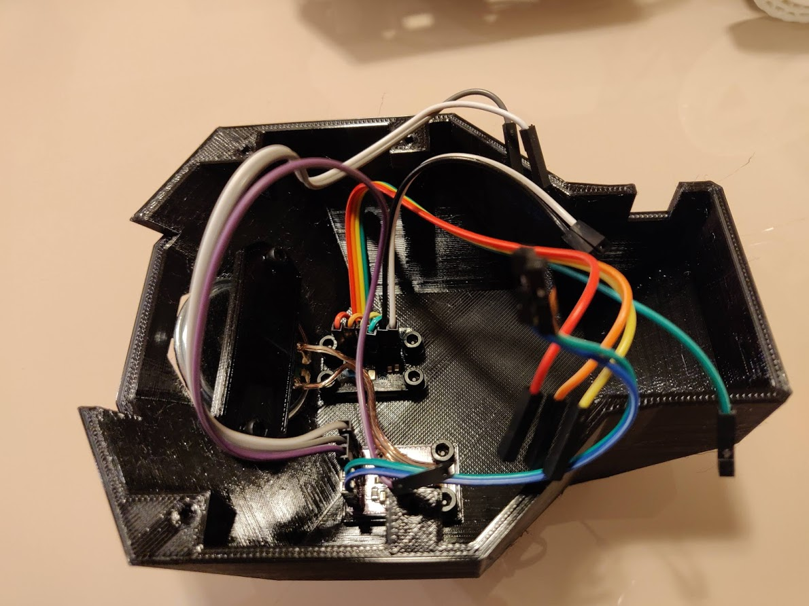</a>
<a href="images/assembly/audio-connection.jpg">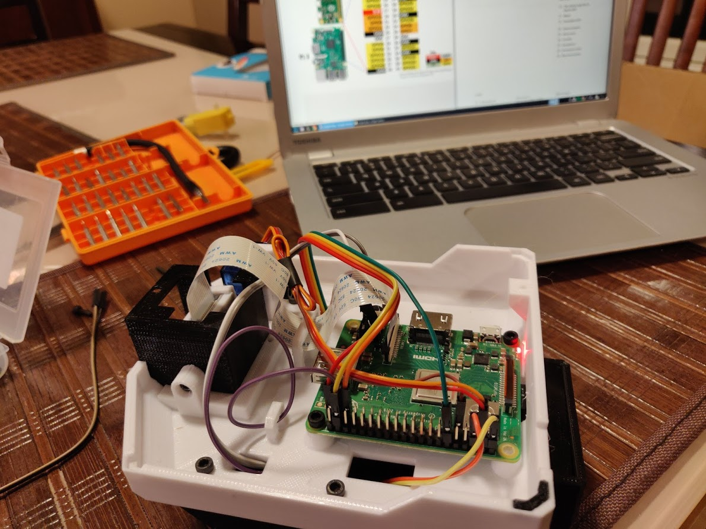</a>
<a href="images/assembly/audio-connection-2.jpg">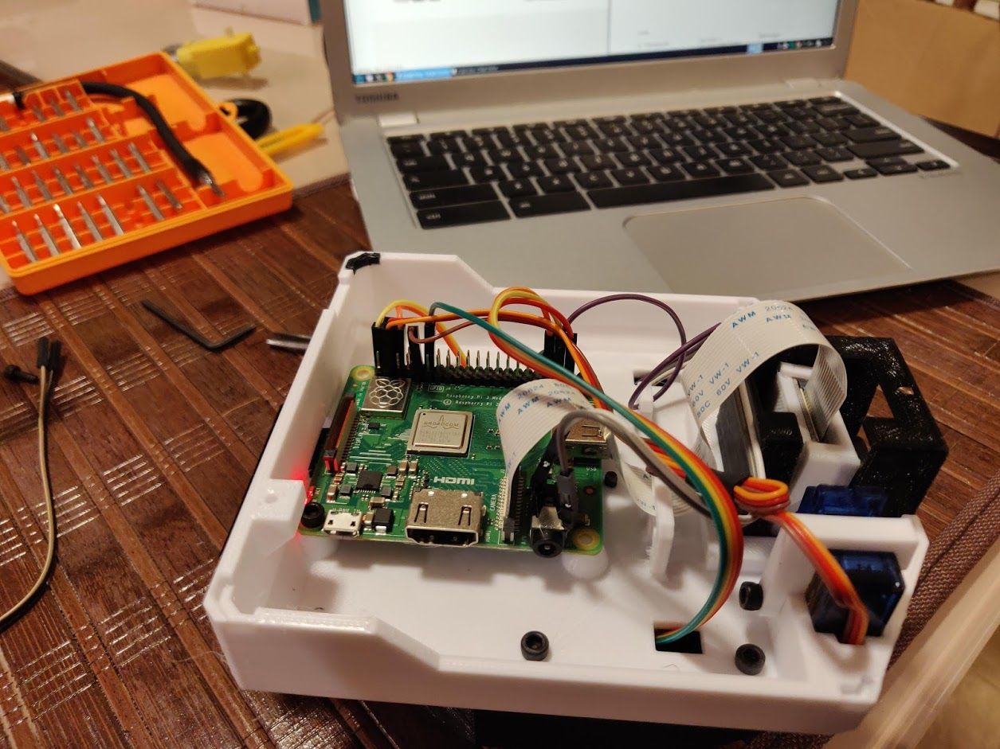</a>
<a href="images/assembly/bonnet-all-connected.jpg">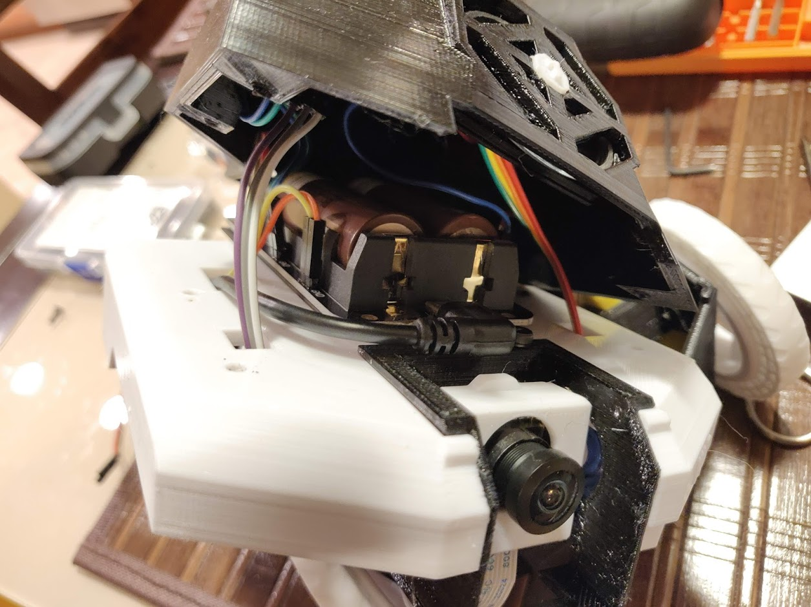</a>
<a href="images/assembly/hbridge-attached.jpg">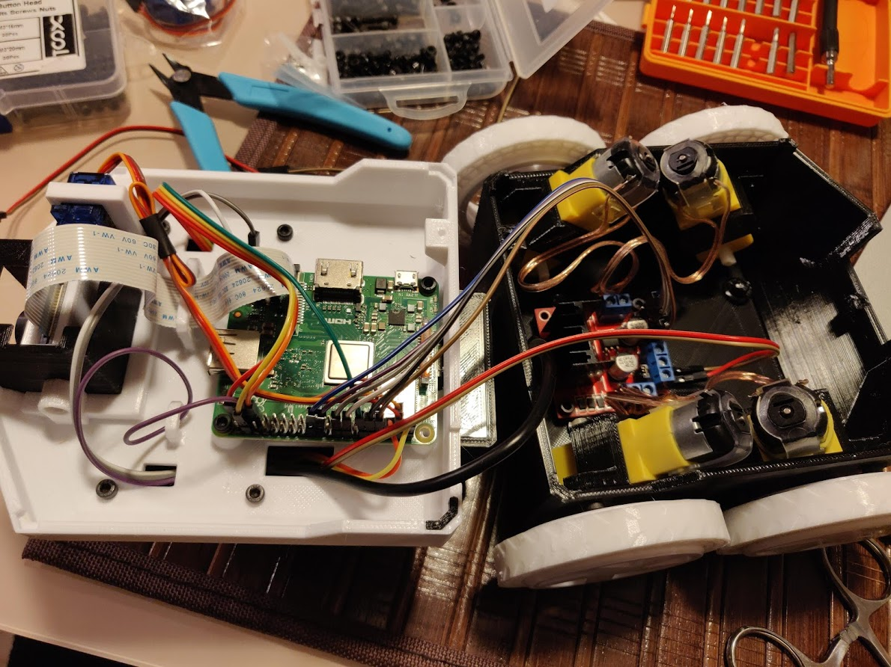</a>
1. Print out audio bonnet.stl, speaker holder.stl, i2s mic holder.stl and mic wire holder.stl
1. Make sure the mounting holes in the amplifier and the microphone are big enough for M3 screws. If not, drill them out as you did with the raspberry pi.
1. Solder the headers onto the amplifier and the microphone.
1. Solder the amplifier to the speaker using about 8CM of wire.
1. The amplifier has a built in volume trim potentiometer that needs to be adjusted before it's set in place. Connect the amplifier to the raspberry pi as outlined in a few steps below, power it on, SSH into it and use "speaker-test" command while adjusting the volume trim. I recommend setting it close to max and then using Watney's built in volume control to turn it down.
1. Attach the amplifier to the bonnet with 6mm bolts. Place the speaker into place, line up the speaker holder behind it and secure it with 6mm bolts. Don't overtighten, but make sure the speaker does not move around.
1. Make sure the microphone hole is clear. Attach the microphone board to the bonnet using the microphone holder and secure it with 6mm bolts.
1. Attach 10CM dupont wires to Vin and GND of the amplifier and the microphone. Attach 20CM wires to the rest of the pins, except SEL of the microphone.
_**NOTE**: The pictures show microphone SEL pin hooked up to GND of Raspberry Pi. SEL pin is used to tell the microphone which channel it should use, GND / 3V SELecting Left or Right. Later, however, I found that leaving the pin unplugged provides better sound quality from the microphone, as the GND is rather floating and may cause noise._
1. Secure the 20CM microphone wires with the wire holder as shown in the picture. This will prevent them from falling out.
1. I highly recommend writing down pin name, wire color, target pin, and taking a picture for reference. In the pictures above, the pinout is as follows:
    
    **Amplifier:**
    
    | Amplifier Pin | Wire Color | Target Pin |
    | ------------- | ---------- | ---------------- |
    | GND | Blue | Power Board GND |
    | Vin | Green | Power Board 5V |
    | SD | Purple | Pin 37 (GPIO 26) |
    | A- | Gray | Audio Jack Front Pin |
    | A+ | White | Audio Jack Back Pin

    **Microphone:**

    | Microphone Pin | Wire Color | Raspberry Pi Pin |
    | ------------- | ---------- | ---------------- |
    | 3V | White | Power Board 3V |
    | GND | Black | Power Board GND |
    | BCLK | Green | Pin 12 (GPIO 18) |
    | DOUT | Yellow | Pin 38 (GPIO 20) |
    | LRCL | Orange | Pin 35 (GPIO 19) |
    | SEL | - | Not Connected |

1. At this point, you can either test your system by hooking up the wires as specified above, or keep going with the assembly.
1. Put the extender cable from the charger client through the hole in the cover and attach it to the charge port of the power board.
1. Attach the 30CM wires from the L298N to 5V / Gnd of the power board.
1. Slowly lower the bonnet onto the cover, making sure not to pinch any wires. Secure it to the cover with 8mm bolts.
1. Remove ENA / ENB jumpers from the L298N, attach 20CM dupont wires to the pins and hook them up as follows:

    | L298N Pin | Wire Color | Target Pin |
    | ------------- | ---------- | ---------------- |
    | ENA | Brown | Pin 8 (GPIO 14) |
    | IN1 | Black | Pin 10 (GPIO 15) |
    | IN2 | White | Pin 16 (GPIO 23) |
    | IN3 | Gray | PIN 18 (GPIO 24) |
    | IN4 | Purple | Pin 22 (GPIO 25) |
    | ENB | Blue | Pin 24 (GPIO 8) |

1. Place the cover onto the bottom, align the tabs and snap it closed. You can use a 16mm bolt in the back and a 6mm bolt on the bottom of the basked to secure the pieces further.
## Wireless charger
Print out dock.stl. I recommend using sticky tape or hot glue to attach the charger to the dock, so it doesn't move. Power it with a USB 2A power adapter (1A won't work).

