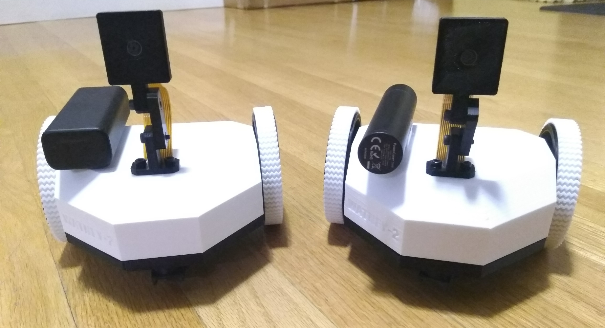

# Watney Rover
Watney is an open source, Raspberry Pi-enabled telepresence rover made of readily available parts.
Non-electronic parts of Watney are 3D printable.
Watney provides a low-latency HD video feed as well as bi-directional audio with echo cancellation.
Watney uses a charging dock with passthrough charging for continuous operation.

# Components
Head over to [Bill of Materials](BOM.md) for a list of components you need to purchase to build your own Watney. You'll also need a 3D printer, some PETG / Tough PLA as well as TPU filament. Lastly, you'll need a soldering iron and some wires, though most connections are made using standard breadboard jumper wire.

# UPS Firmware Update
Before you start assembling your Watney, be sure to update the firmware of the UPS power supply. At the time of writing, the latest firmware is *v10* - all previous firmware versions suffered from occasional lockups. You can find [firmware update instructions here.](https://wiki.52pi.com/index.php/EP-0136#Method_2)

# Printing the parts
You can find all 3D printable parts in the [STLs folder](https://github.com/nikivanov/watney/tree/master/STLs). I recommend printing everything but the tires in PETG (I used eSun PETG) or at least Tough PLA. I find regular PLA to be too brittle but YMMV. Print the tires in TPU - Hatchbox TPU worked great for me, but others will almost certainly work just as well.

Print every part with 0.2mm layer height. No supports are needed. The base part includes tearaway lilypads to help with adhesion. Generally, the prints can take a long time but none of them are particularly challenging to print.

# Assembly
You'll be working with Lithium Ion batteries - please be careful not to puncture or short them, as they can become a fire hazard if used improperly. **You assume all responsibility for damages that may be caused by your Watney, whether it's assembled correctly or otherwise.**

Click on the [Releases](https://github.com/nikivanov/watney/releases) tab and download the latest Watney SD card image - it's the large .zip file found under *Assets*. Use [balenaEtcher](https://www.balena.io/etcher/) or similar to write the .img file onto the SD card.

After that, follow the detailed assembly video below!
 
# Configuration
Upon startup, Watney will detect if it's connected to a Wi-Fi hotspot. If not, it will host its own hotspot "Watney".
Once you connect to the hotspot, you can control it directly by going to https://192.168.4.1:5000, or connect it to a Wi-Fi
hotspot by going to http://192.168.4.1 Once you specify your WiFi credentials, Watney will take some time to reboot. Once you hear the startup sound, you're good to go!

Default SSH credentials for Watney are pi / watney5. Watney's mDNS name is watney.local, so if your OS supports mDNS you can simply access it at https://watney.local:5000

Watney's configuration can be found in ~/watney/rover.conf:
* If you want to use different GPIO pins, you can specify them here
* If you find motors on either side running in reverse (backwards when it's supposed to be rotating forward) simply swap ForwardPin 
and ReversePin
* Restart your Watney for configuration changes to take effect

    ## Off Charger re-docking
    Watney can detect when it is taken off the charger outside of its own movement and can attempt to re-dock by driving forward for one second. In my case, Watney occasionally gets knocked off the charger by my Roomba, so enabling this functionality ensures that Watney is always docked and charging. By default this functionality is disabled: I didn't want Watney to drive off someone's workbench while they are working on it. If you'd like to enable this functionality, set `Enabled=True` in the `OFFCHARGER` section of the config.
# Remote Access
Watney has no authentication / security. If you'd like to set it up for remote access, I recommend using [Zerotier](https://www.zerotier.com/). Adding Watney and your client computer to the same Zerotier network will make it appear as if they are on the same local network.

# Building your own Watney image
`packer-builder-arm` is used to build the Watney image. You can find the image build definition in [watney-image.json](packer/watney-image.json). [This article](https://linuxhit.com/build-a-raspberry-pi-image-packer-packer-builder-arm/#:~:text=Packer%2Dbuilder%2Darm%20is%20a,server%20or%20other%20x86%20hardware.) may help setting up `packer` and `packer-builder-arm` on your linux system.

# Troubleshooting
* Watney works best with Chrome. Other browsers may not work well, or at all.
* Feel free to file an issue on GitHub if you have questions!

# Open Source Acknowledgements
The following open source projects were used in development of Watney:
* [Janus WebRTC Server](https://janus.conf.meetecho.com/)
* [GStreamer](https://gstreamer.freedesktop.org/)
* [Raspberry Pi Turnkey](https://github.com/schollz/raspberry-pi-turnkey) 

# Future Improvements

There have been numerous hardware iterations of Watney, starting from a humble line-follower built for a hackday work project, to the telepresence rover it is today. I'm not planning on adding new hardware iterations, as the latest version accomplishes everything I've envisioned for this project. That being said, there are still some software improvements to be made:
* **Mobile-optimized control.** You'll be able to control your watney from your phone / tablet, especially in tandem with Remote Access.
* **Better browser compatibility.** There's no reason it can't work in all major browsers.