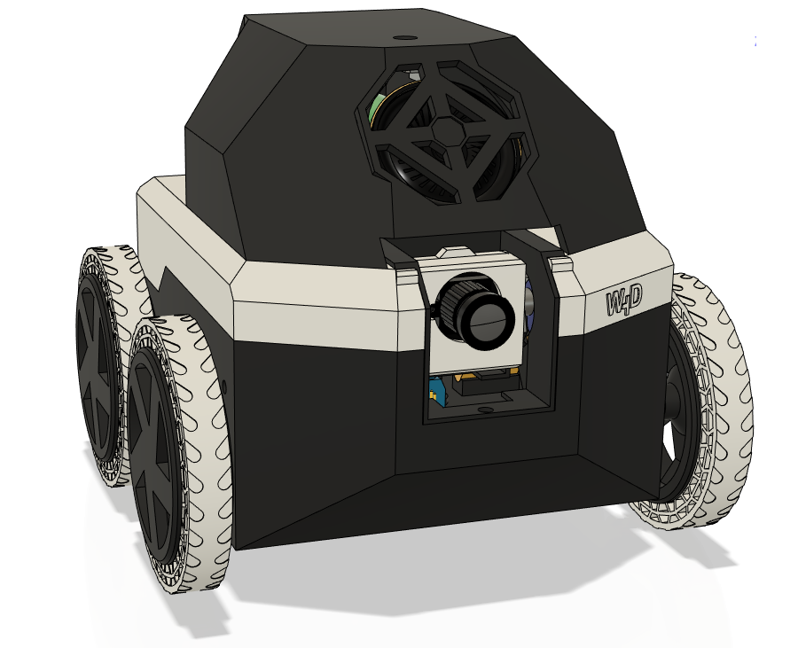

<a href="https://www.youtube.com/watch?v=a-NR-ddZKII"></img></a>

# Watney Rover
Watney is a low-cost, open source, Raspberry Pi-enabled telepresence rover made of readily available parts.
Non-electronic parts of Watney are 3D printable.
Watney provides a low-latency HD video feed as well as bi-directional audio.
Watney uses a wireless charging dock with passthrough charging so it can be left on indefinitely.

Watney uses [Janus WebRTC Server](https://janus.conf.meetecho.com/) and [Raspberry Pi Turnkey](https://github.com/schollz/raspberry-pi-turnkey) 
 

# Components
Head over to [Bill of Materials](BOM.md) for a list of components you need to purchase to build your own Watney. You'll also need a 3D printer, some PETG / Tough PLA as well as TPU filament. Lastly, you'll need a soldering iron and some wires, though most connections are made using standard breadboard jumper wire.

# Assembly
Detailed [assembly instructions](ASSEMBLY.md) can be found here. One of the goals of developing Watney is to make it easy to assemble - like IKEA furniture of electronics. Go slow and double-check your work. Take extra caution not to reverse polarity when hooking up components, as most of them will burn out if hooked up in reverse. You'll be working with LiPol batteries - please be careful not to puncture or short them, as they can become a fire hazard if used improperly. **You assume all responsibility for damages that may be caused by your Watney, whether it's assembled correctly or otherwise.**

# Raspberry Pi 3A+ Image
A pre-compiled SD card image can be found in [Releases](https://github.com/nikivanov/watney/releases). Find the latest release, expand "Assets" and download the large .zip file.

# Configuration
Upon startup, Watney will detect if it's connected to a Wi-Fi hotspot. If not, it will host its own hotspot "Watney4".
Once you connect to the hotspot, you can control it directly by going to https://192.168.4.1:5000, or connect it to a Wi-Fi
hotspot by going to http://192.168.4.1 Once you specify your WiFi credentials, Watney will take some time to reboot. Once you hear the startup sound, you're good to go!

Default SSH credentials for Watney are pi / watney4. Watney's mDNS name is watney4.local.

Watney's configuration can be found in ~/watney/rover.conf:
* If you want to use different GPIO pins, you can specify them here
* If you find motors on either side running in reverse (backwards when it's supposed to be rotating forward) simply swap ForwardPin 
and ReversePin
* Restart your Watney for configuration changes to take effect

# Remote Access
Watney has no authentication / security. If you'd like to set it up for remote access, I recommend using [Zerotier](https://www.zerotier.com/). Adding Watney and your client computer to the same Zerotier network will make it appear as if they are on the same local network.

# Troubleshooting
* Raspberry Pi has no ADC which means there's no way to read battery voltage without additional circuitry. However, an easy way to verify that your Watney is charging is to place the dock near a wall - you should be able to see the reflection of the glow from the charger via Watney's video feed.
* When camera moves up and down, you may notice stuttering / jitter. This happens because servo's PWM signal is generated in software. Since PWM is used for audio and PCM is used for I2S microphone, there are no more hardware interrupts for hardware-timed PWM signal generation. See Future Improvements for additional info.
* If you find your Watney randomly restarting when you move the camera, that means that the servo is drawing too much power from the Raspberry Pi. You can hook up the amplifier to one of the 3V outputs of the power board instead, and power the servo from the 5V output that was previously used by the amplifier.
* Watney works best with Chrome. Other browsers may not work well, or at all.
* Feel free to file an issue on GitHub if you have questions!

# Future Improvements
* **Better browser compatibility.** There's no reason it can't work in all major browsers.
* **Mobile-optimized control.** You'll be able to control your watney from your phone / tablet, especially in tandem with Remote Access.
* **Better volume scaling.** The volume slider is only usable at the top range - anything below 70% is barely audible. The slider should be scaled to control only the usable range instead.
* **Hardware-timed PWM.** Currently, PWM signal for motors and the camera servo are generated in software, which is the cause for the servo jitter. [pigpio](http://abyz.me.uk/rpi/pigpio/) is capable of generating very accurate hardware-timed PWM signals on any GPIO pin, but it needs either hardware PWM or PCM, both of which are used for audio. However, we only use one PWM channel for audio, so it may be possible to use the second channel for pigpio.
* **Timing Belts.** Coupling each pair of motors with a timing belt should greatly improve driving over very rough terrain.

